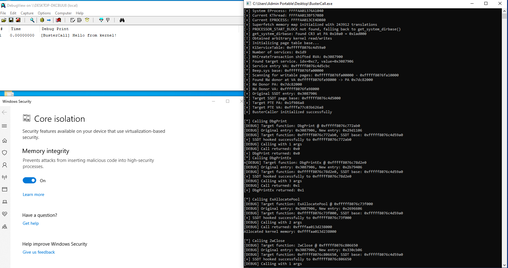

# BusterCall


<b>"Bypassing" HVCI (Hypervisor-protected Code Integrity) via donor PFN swaps to modify read-only code pages.</b>



---

## Overview

**BusterCall** demonstrates a technique to bypass Windows Hypervisor-protected Code Integrity (HVCI) by leveraging Page Frame Number (PFN) manipulation. The tool enables calling arbitrary kernel functions from user-mode on HVCI-enabled systems by hijacking the System Service Descriptor Table (SSDT) through PFN manipulation.

---

## Understanding HVCI and Virtual Trust Levels


### What Does HVCI Protect?

HVCI enforces code integrity at the hypervisor level:

| Protection | Description |
|------------|-------------|
| **W^X Enforcement** | Pages cannot be both Writable AND Executable simultaneously |
| **Unsigned Code Prevention** | Blocks execution of unsigned kernel code |
| **Code Page Protection** | Kernel code pages are marked read-only and non-writable |
| **Pool Integrity** | NonPagedPoolNx prevents executable pool allocations |

### The Critical Insight: HVCI Only Validates Page Attributes

Here's the key vulnerability: **HVCI security checks are based solely on page security attributes (the PTE), not the actual physical content of the page.**

When the kernel accesses a virtual address, it walks the page tables:
1. Virtual Address -> PTE lookup
2. PTE contains the PFN (Page Frame Number) pointing to the physical page
3. HVCI checks the **attributes in the PTE** (R/W/X bits)

If we modify the PFN in a PTE to point to a *different* physical page, HVCI's checks are performed on the attributes we set, not on the original protected page. This is the foundation of the PFN swapping attack.

---

## The PFN Swapping Technique

### Why Do We Need a "Donor Page"?

The targets reside in read-only pages. HVCI prevents us from:
- Modifying the page attributes to add Write permission
- Allocating new RWX pages
- Writing directly to read-only kernel memory

**However**, HVCI does not prevent us from:
- Finding an *existing* legitimate writable page (the "donor")
- Copying content to that writable page
- Modifying the PFN to point to the donor's physical address

The donor page is a legitimate, already-writable kernel page (typically from a driver's `.data` section like Beep.sys). Because it's already marked RW, no HVCI violations occur when we write to it.

### The Attack Flow

```
┌─────────────────────────────────────────────────────────────────────────┐
│                         PFN Swap Attack Sequence                        │
├─────────────────────────────────────────────────────────────────────────┤
│                                                                         │
│  STEP 1: Identify Target Page (Read-Only)                          │
│  ┌─────────────────────────────────────────────────────────────────┐   │
│  │  Virtual Address: 0xFFFFF802`12340000 (SSDT Page)               │   │
│  │  PTE.PFN: 0x1A2B3 → Physical: 0x1A2B3000                        │   │
│  │  Attributes: Present=1, R/W=0 (Read-Only), NX=0                 │   │
│  └─────────────────────────────────────────────────────────────────┘   │
│                                     │                                   │
│                                     ▼                                   │
│  STEP 2: Find Donor Page (Writable .data Section)                       │
│  ┌─────────────────────────────────────────────────────────────────┐   │
│  │  Donor VA: 0xFFFFF802`AAAA0000 (Beep.sys .data)                 │   │
│  │  Donor Physical: 0xDEAD0000                                     │   │
│  │  Attributes: Present=1, R/W=1 (Writable), NX=1                  │   │
│  └─────────────────────────────────────────────────────────────────┘   │
│                                     │                                   │
│                                     ▼                                   │
│  STEP 3: Copy SSDT Page Content to Donor Physical Page                  │
│  ┌─────────────────────────────────────────────────────────────────┐   │
│  │  memcpy(DonorVA, SsdtPageContent, 4096);                        │   │
│  │  // Now 0xDEAD0000 contains exact copy of SSDT page             │   │
│  └─────────────────────────────────────────────────────────────────┘   │
│                                     │                                   │
│                                     ▼                                   │
│  STEP 4: Modify the Copied SSDT Entry in Donor                          │
│  ┌─────────────────────────────────────────────────────────────────┐   │
│  │  // Change syscall entry to point to our target function        │   │
│  │  CopiedSSDT[NtCreateTransactionIndex] = TargetFunctionRVA;      │   │
│  └─────────────────────────────────────────────────────────────────┘   │
│                                     │                                   │
│                                     ▼                                   │
│  STEP 5: Swap PFN in Target PTE                                         │
│  ┌─────────────────────────────────────────────────────────────────┐   │
│  │  BEFORE:                          AFTER:                        │   │
│  │  PTE.PFN = 0x1A2B3               PTE.PFN = 0xDEAD0              │   │
│  │       │                               │                         │   │
│  │       ▼                               ▼                         │   │
│  │  Original SSDT                    Modified SSDT                 │   │
│  │  (untouched)                      (in donor page)               │   │
│  └─────────────────────────────────────────────────────────────────┘   │
│                                     │                                   │
│                                     ▼                                   │
│  STEP 6: Invoke Syscall - Redirected!                                   │
│  ┌─────────────────────────────────────────────────────────────────┐   │
│  │  NtCreateTransaction() syscall now executes ExAllocatePool()    │   │
│  │  because the SSDT entry was redirected in our swapped page      │   │
│  └─────────────────────────────────────────────────────────────────┘   │
│                                     │                                   │
│                                     ▼                                   │
│  STEP 7: Restore Original PFN                                           │
│  ┌─────────────────────────────────────────────────────────────────┐   │
│  │  PTE.PFN = 0x1A2B3  (restore original mapping)                  │   │
│  │  No persistent modifications - PatchGuard safe                  │   │
│  └─────────────────────────────────────────────────────────────────┘   │
│                                                                         │
└─────────────────────────────────────────────────────────────────────────┘
```

### Why This Bypasses HVCI

| HVCI Check | Our Action | Result |
|------------|------------|--------|
| "Is this page writable?" | We write to an already-writable donor page | **PASS** - Donor is legitimately RW |
| "Is code being modified?" | Original SSDT page is never touched | **PASS** - We only change the PTE mapping |
| "Are page attributes being modified?" | We only change the PFN, not the R/W/NX bits | **PASS** - Attributes remain valid |
| "Is unsigned code being executed?" | We call legitimate signed kernel functions | **PASS** - All code is Microsoft-signed |

**The fundamental weakness:** VTL1's HVCI enforcement runs in a separate context and validates page attributes. It cannot detect that VTL0's page tables have been manipulated to point to different physical pages. The Second Level Address Translation (SLAT/EPT) would need to protect the page tables themselves, but in current implementations, PTEs are not comprehensively monitored for PFN changes.

---

## The ASUS Driver Primitive

This project leverages a previously undisclosed vulnerable ASUS driver that provides arbitrary physical memory read/write capabilities. The driver is legitimately signed by ASUS and passes Driver Signature Enforcement (DSE).

### Driver Capabilities

```cpp
// Read arbitrary physical memory
ReadPhysicalMemory(PhysicalAddress, Buffer, Size);

// Write arbitrary physical memory  
WritePhysicalMemory(PhysicalAddress, Buffer, Size);
```

---

## Example

```cpp
// Initialize the BusterCall system
if (!InitializeBusterCaller()) {
    printf("[-] Failed to initialize\n");
    return;
}

// Call DbgPrint from usermode
CallKernelFunction<NTSTATUS>("DbgPrint", "[BusterCall] Hello from kernel!\n");

// Allocate kernel pool memory
auto Pool = CallKernelFunction<PVOID>("ExAllocatePool", NonPagedPool, 0x1000);
printf("Allocated kernel pool: 0x%llx\n", Pool);

// Call any exported kernel function
CallKernelFunction<NTSTATUS>("ZwClose", SomeHandle);
```

---

## Security Mitigation Analysis


### Mitigations

| Mitigation | What we do |
|------------|--------|
| **HVCI / Core Isolation** | PFN swap doesn't modify protected pages or change page attributes |
| **PatchGuard (KPP)** | Changes are transient, restored before timer fires |
| **SMEP** | Never execute user pages from kernel |
| **SMAP** | Never access user pages from kernel inappropriately |
| **kCET (Shadow Stack)** | No ROP chains, legitimate control flow |
| **kCET (IBT)** | All targets are valid kernel function entry points |


### Why kCET Doesn't Help

Kernel Control-flow Enforcement Technology (kCET) provides:
- **Shadow Stack:** Protects return addresses from corruption
- **Indirect Branch Tracking:** Validates indirect call/jump targets start with ENDBR64

This attack doesn't subvert control flow - it redirects the SSDT to point to a different **legitimate** kernel function. The syscall dispatch mechanism follows normal execution paths:

```
Normal:     syscall → KiSystemCall64 → SSDT[idx] → NtCreateTransaction
Attacked:   syscall → KiSystemCall64 → SSDT[idx] → ExAllocatePool (still a valid function)
```

All indirect calls target valid Microsoft-signed code with proper ENDBR64 prologues.

---

### References

- **[HEXACON2023](https://www.youtube.com/watch?v=WWvd2_jd0ZI)** - Viviane Zwanger and Henning Braun
- **[jonomango/superfetch](https://github.com/jonomango/superfetch)**

## License
This project is released for educational purposes. See individual source files for applicable licenses.
